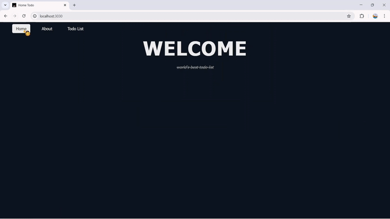

My first backend project, raised with the patient guidance of the legendary YouTube sensei [Net Ninja](https://www.youtube.com/watch?v=w-7RQ46RgxU&list=PL4cUxeGkcC9gcy9lrvMJ75z9maRw4byYp).

<p align="center">
  
</p>

## How to run

```bash
npm install && npm run deptrai
```
